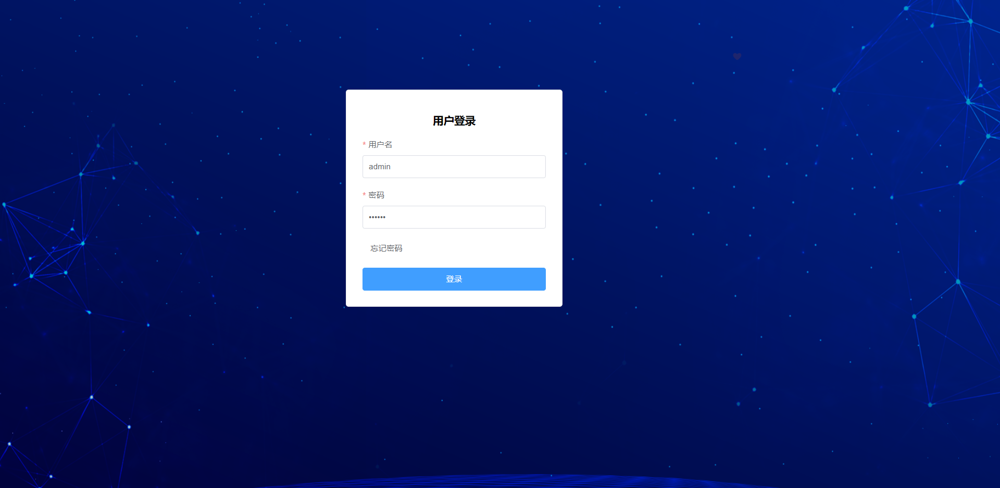
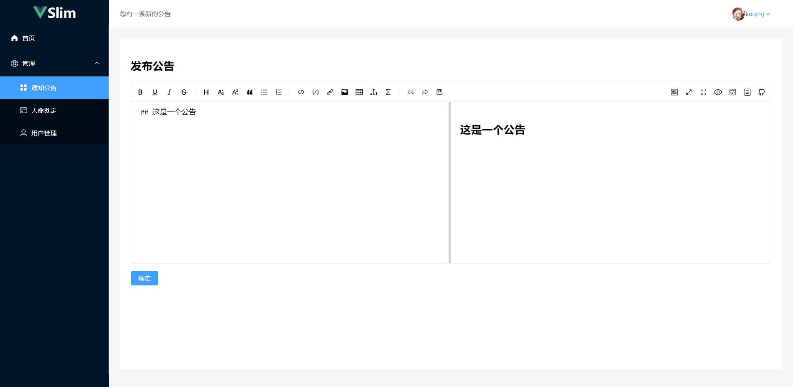

# slim-admin 

> 一个简洁的不能再简洁的admin

 麻雀虽小,五脏俱全,包括路由,token,axios等(主题,响应式,插件,权限,动态路由等需要自行配置)

使用的组件
- vue (使用了reactive transform)
- vue-router
- pinia
- axios
- element-plus
- scss (tailwind是好用,但是读一长串class太累了)
- vite
- typescript
- @vueuse/core

## 登录界面

## 后台界面

